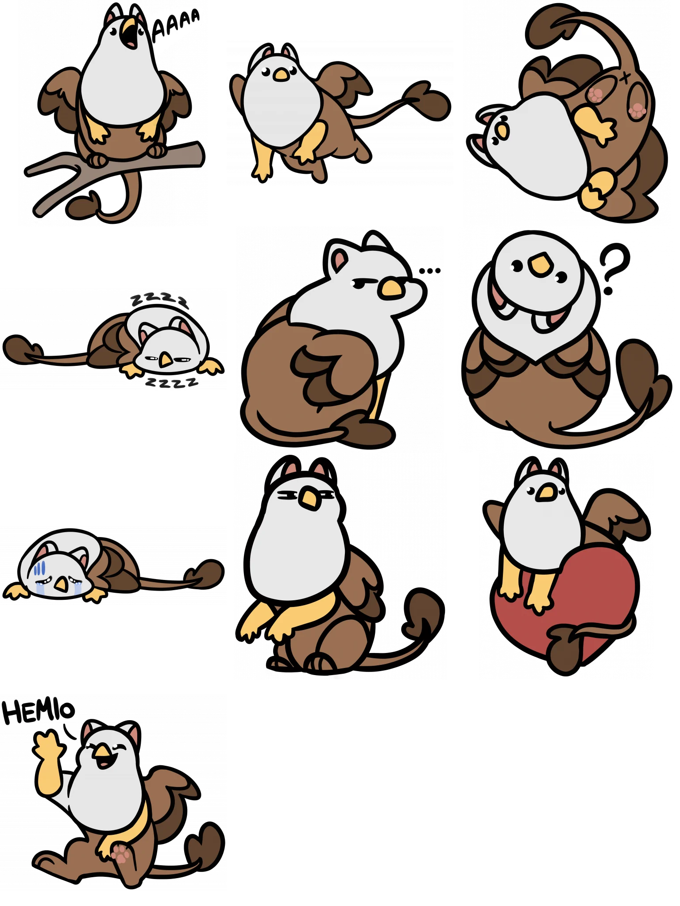

# Gridify

Gridify is a program to arrange high resolution images in a grid, written in pure rust. It is currently a working prototype.

All art provided for test and demo is from >> https://linktr.ee/JonGriffon << go support him.
